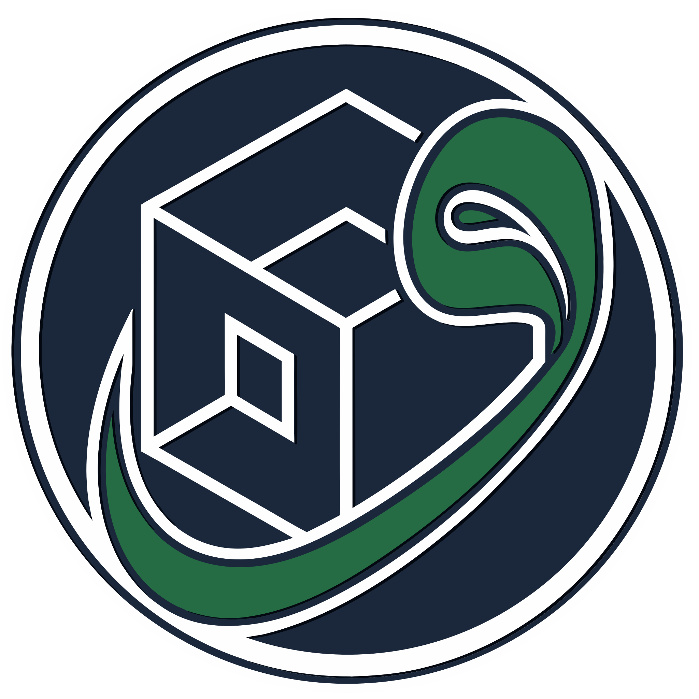

<!-- markdownlint-disable MD033 MD060 -->

<p align="center">
  
</p>

<h1 align="center">Wajiha - واجهة</h1>

<p align="center">
  <strong>Dual-screen emulation launcher for Android.</strong><br/>
  A HOME app for the AYN Thor: hero on one display, the library on the
  other. Kotlin Multiplatform · gamepad-first · one process for both screens.
</p>

<p align="center">
  <a href="https://github.com/Shenepoy/Wajiha/releases/latest"></a>
  <a href="https://github.com/Shenepoy/Wajiha/actions/workflows/ci.yml"></a>
  <a href="https://github.com/Shenepoy/Wajiha"></a>
  <a href="https://apps.obtainium.imranr.dev/redirect.html?r=obtainium://add/https://github.com/Shenepoy/Wajiha/releases"></a>
  
  
  <a href="LICENSE"></a>
</p>

<p align="center">
  <a href="https://github.com/Shenepoy/Wajiha/releases/latest"><strong>Latest release</strong></a>
  ·
  <a href="#what-you-get">What you get</a>
  ·
  <a href="#install">Install</a>
  ·
  <a href="#develop">Develop</a>
  ·
  <a href="#docs">Docs</a>
  ·
  <a href="README.ar.md">العربية</a>
</p>

<p align="center">
  The name <strong>Wajiha</strong> comes from Arabic
  <span dir="rtl"><strong>واجهة</strong></span>
  (<em>wājaha</em>): interface — the face of the handheld.
</p>

---

## What you get

The library stays on the device. A single screen uses one combined layout.

| | |
|---|---|
| **Library** | Hero art on one display, the game grid on the other. Roles can swap. |
| **Launch** | Emulators, including RetroArch, with per-game overrides. |
| **Artwork** | ScreenScraper, SteamGridDB, libretro thumbnails, RetroAchievements, RomM, or a local folder. |
| **Now Running** | A game started outside Wajiha still shows on the other screen. |
| **Gamepad** | D-pad focus, face buttons, and a hint bar. |
| **Collections** | Group games in the library. ROM files stay where they are. |

---

## Install

### Android

| Option | |
|--------|--|
| **Obtainium** (recommended) | [](https://apps.obtainium.imranr.dev/redirect.html?r=obtainium://add/https://github.com/Shenepoy/Wajiha/releases) — tracks [GitHub Releases](https://github.com/Shenepoy/Wajiha/releases) |
| **APK** | From the [latest release](https://github.com/Shenepoy/Wajiha/releases/latest) |

`Wajiha-<version>.apk` is the universal build. Each release also has one APK per ABI. Android 11 or newer.

---

## Develop

**Requirements:** JDK 21, Android SDK (`sdk.dir` in `local.properties`).

```bash
git clone https://github.com/Shenepoy/Wajiha.git
cd Wajiha
./gradlew :androidApp:assembleDebug
```

```bash
./scripts/ktlint.sh check
./gradlew :composeApp:testAndroidHostTest :androidApp:test
```

ScreenScraper credentials go in **Settings → Scraper → Accounts**. CI, signing, and tagged releases are in [docs/ci.md](docs/ci.md). Thor install and logs are in [docs/debug.md](docs/debug.md).

## Project layout

- `composeApp/` — UI, domain, database, and scrapers.
- `androidApp/` — Android host: activities, launch, displays, and workers.
- `docs/` — architecture, design, gamepad, sessions, and CI.
- `Study/` — reference notes kept beside the app.

Both displays run in one process. Shared state is a `StateFlow`, wired with Koin.

---

## Docs

| Guide | |
|-------|--|
| [Architecture](docs/architecture.md) | Modules, data, and the dual-screen state machine |
| [Design](docs/design.md) | Shared chrome and how screens are built |
| [Gamepad](docs/gamepad.md) | Focus, hints, and touch-scroll snap |
| [Sessions](docs/sessions.md) | Now Running and playtime |
| [External APIs](docs/external-apis.md) | Scraper and RetroAchievements sources |
| [CI and releases](docs/ci.md) | Lint, tests, signed APKs, Obtainium |
| [Thor debug](docs/debug.md) | Install and logs on device |

---

## License

[GNU AGPL-3.0](LICENSE).

Button glyphs are [Kenney Input Prompts](https://kenney.nl/assets/input-prompts) (CC0) by [Kenney](https://kenney.nl).

---

<p align="center">
  Made by <a href="https://shenepoy.com"><strong>shenepoy</strong></a>
  ·
  <a href="https://github.com/Shenepoy">GitHub</a>
</p>
