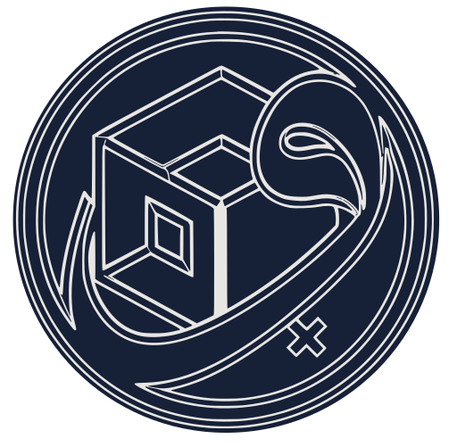

<!-- markdownlint-disable MD033 MD060 -->

<p align="center">
  
</p>

<h1 align="center">Wajiha - واجهة</h1>

<p align="center">
  <strong>Dual-screen emulation launcher for Android</strong><br/>
  HOME replacement and system controller — built for the <strong>AYN Thor</strong><br/>
  (top + bottom displays) with a graceful single-display fallback.<br/>
  3DS-style UX · Kotlin Multiplatform · gamepad-first.
</p>

<p align="center">
  <a href="https://github.com/Zyzto/Wajiha/releases/latest"></a>
  <a href="https://github.com/Zyzto/Wajiha"></a>
  <a href="https://apps.obtainium.imranr.dev/redirect.html?r=obtainium://add/https://github.com/Zyzto/Wajiha/releases"></a>
  
  
  
  
</p>

<p align="center">
  <a href="https://github.com/Zyzto/Wajiha/releases/latest">Latest release</a>
  ·
  <a href="docs/architecture.md">Documentation</a>
</p>

<p align="center">
  <a href="#what-you-get">What you get</a> ·
  <a href="#install">Install</a> ·
  <a href="#requirements">Requirements</a> ·
  <a href="#build">Build</a> ·
  <a href="#first-run-setup">First-run</a> ·
  <a href="#gamepad-navigation">Gamepad</a> ·
  <a href="#dual-screen-behavior">Dual-screen</a> ·
  <a href="#project-structure">Structure</a> ·
  <a href="docs/architecture.md">Docs</a> ·
  <a href="README.ar.md">العربية</a>
</p>

<p align="center">
  The name <strong>Wajiha</strong> comes from Arabic
  <span dir="rtl"><strong>واجهة</strong></span>
  (<em>wājaha</em>): interface / facade —
  the face of the handheld.
</p>

---

## What you get

Wajiha combines the best patterns from four studied apps (NeoStation, Daijishō, Cocoon, iiSU — see `Study/docs/`):

- **3DS-style UX** — top screen shows the focused game's box art / logo / metadata (customizable hero layout), bottom screen is a horizontally scrolling game grid with an optional home dock
- **Dual-screen engine** — a shared state machine drives both displays from one process; while a game runs the other screen can show Now Running, Quick Settings, Running Apps, a Clock, or black out entirely
- **Running-app detection** — even games launched *outside* Wajiha are detected (UsageStats polling + optional AccessibilityService) and pushed to the secondary screen
- **NeoStation-grade launching** — SAF URI grants, FileProvider rewrap, multi-disc sibling grants, RetroArch core/config defaults, per-game emulator overrides
- **Deep scraping** — six sources (ScreenScraper, SteamGridDB, libretro-thumbnails, RetroAchievements, RomM, local media) with per-media-type source priority, region/language chains, batch jobs, and a manual match UI — including Cocoon-style square covers alongside boxart
- **RetroAchievements** — hash/title game linking via the Web API, used for scrape metadata and progress lookups

## Install

### Android

| Option | |
|--------|--|
| **Obtainium** (recommended) | [](https://apps.obtainium.imranr.dev/redirect.html?r=obtainium://add/https://github.com/Zyzto/Wajiha/releases) — tracks [GitHub Releases](https://github.com/Zyzto/Wajiha/releases) |
| **APK** | Download `Wajiha-<version>.apk` from [latest release](https://github.com/Zyzto/Wajiha/releases/latest) |

## Requirements

- Android 11+ (minSdk 30, the Thor's shipping OS)
- JDK 17+, Android SDK (set `sdk.dir` in `local.properties`)
- Kotlin Multiplatform project — Android is the only finished target; the iOS source sets are scaffolding

## Build

```bash
./gradlew :androidApp:assembleDebug     # debug APK
./gradlew :androidApp:assembleRelease   # R8-minified release APK (signed if keystore props set)
./gradlew :composeApp:testAndroidHostTest  # host-side unit tests (importers, parsers, scanner)
./gradlew :androidApp:test                 # Android unit tests (ROM path probes)
./gradlew :androidApp:connectedDebugAndroidTest  # instrumented + smoke (device/emulator)
./scripts/ktlint.sh check
./scripts/install-thor.sh               # install debug APK on Thor + launch
./scripts/thor-e2e.sh                   # Thor boot smoke (local / agent; not CI)
```

CI on every PR/`main` push runs ktlint, unit tests, release assemble, and emulator instrumented tests. Tag `vX.Y.Z` publishes a signed release APK — see [docs/ci.md](docs/ci.md).

ScreenScraper’s API requires a developer app pair (`devid` / `devpassword`) on every call, plus your user login in Settings for quotas. Enter Dev ID/password in **Settings → Scraper → Accounts**, or (for local builds) in `~/.gradle/gradle.properties`:

```properties
wajiha.screenscraper.devid=YOUR_DEV_ID
wajiha.screenscraper.devpassword=YOUR_DEV_PASSWORD
```

Blank values are omitted from requests — never sent as empty `devid=`.

## First-run setup

The onboarding wizard walks through everything, but for reference:

| Permission / role | Why | Required? |
|---|---|---|
| Default home app | Own both screens, survive the HOME button | Recommended |
| Usage access | Detect games launched outside Wajiha | For manual-launch detection |
| Modify system settings | Brightness / screen-timeout sliders | For quick settings |
| Notifications | Scan & scrape progress, keep-alive service | Recommended |
| All files access | Direct file paths for emulators that reject `content://` URIs | Optional |
| Accessibility service | Instant (event-driven) game detection instead of 2 s polling | Optional |

Then:

1. **Settings → Library** — add ROM folders per platform (SAF folder picker). A background scan starts automatically; CRC32/MD5 hashes are computed lazily.
2. **Settings → Scraper → Accounts** (and **Sources**) — enter credentials for the sources you use (ScreenScraper account, SteamGridDB API key, RetroAchievements username + web API key, RomM server, or a local media folder in ES-DE layout). Use **Test login** where available. Scraper hub rows open as fullscreen pages (Back + title), not nested folder tabs.
3. **Settings → Scraper → Batch scrape** — pick **Fill gaps** or **Force**, then scrape everything or per platform. Runs as a foreground WorkManager job with progress, pause/resume, cancel, and **Retry failed** for partial/error games. Outcomes are split into matched / partial / no match / errors, with an expandable issues list.
4. **Platform → Scraper** — same modes plus **Review** (interactive queue). Warnings when linkage IDs (ScreenScraper / RA / Libretro) are missing.
5. **Game detail → Scraper** — Fill gaps / Force one-shot, or open the shared review picker for that game.

## Gamepad navigation

Full controller support for handhelds: D-pad focus, A confirm, B back, layered modals, and per-screen hint bars with scheme-aware glyphs (Auto / Xbox / PlayStation / Switch). See [docs/gamepad.md](docs/gamepad.md).

Button icons use **[Kenney Input Prompts](https://kenney.nl/assets/input-prompts)** (CC0) by [Kenney](https://kenney.nl).

### Library grid: touch scroll → D-pad

After you **touch-scroll** the home library, the **first D-pad press** does not step from the old (now off-screen) selection. It **snaps** onto a top-row tile that is still meaningfully on-screen:

- Snap side follows **where selection sat when the scroll began** (left half of the screen → leading / first visible; right half → trailing / last visible) — not which D-pad direction you pressed.
- Only tiles that are **≥ ~50% on-screen** count; when possible the snap prefers a **fully** on-screen edge tile so focus does not land on a thin peek.
- Further D-pad presses then move normally one tile at a time (selection-driven scroll, at most one column per step).
- Tapping a tile clears the pending snap so the next D-pad press moves from that game instead.

Lists / settings use a simpler “land on the topmost in-view row” snap after touch scroll. Details and caveats: [docs/gamepad.md](docs/gamepad.md#touch-scroll--d-pad-snap) (this flow may still get a polish pass).

## Game detail & platform settings

- **Game detail** — per-game metadata, media, launch options, play history (`GameDetailScreen`)
- **Platform settings** — per-platform ROM folders, emulator overrides, scraper overrides (`PlatformSettingsScreen`)

## ROM reconciliation

When **Settings → Library → detect external games** is enabled, Wajiha probes emulator data files (RetroArch history, AetherSX2 playtime) to match games launched outside the launcher.

## Multi-session Now Playing

Concurrent emulator sessions appear as grid tiles in the game library; tap to switch, Y to close. Playtime is tracked per package. See [docs/sessions.md](docs/sessions.md). Thor debug: [docs/debug.md](docs/debug.md).

## Appearance & home

- **Settings → Appearance → Show home dock** — pin strip above gamepad hints (`WajihaDock`); pins match Apps favorites. Apps / Settings shortcuts on the dock hide the redundant chrome actions when enabled (default on).
- **Settings → Appearance → Icon pack / Icon shape** — Nova/ADW-style icon packs for the Apps drawer and dock. Shapes: System, Circle, Squircle, Rounded square, Square.
- **Settings → Appearance → Game grid** — per-display prefs (whichever display hosts Settings): art style Cover / Icon / Logo, rows 2–5, tile size S/M/L, show titles, show tile border + gradient. **Icon** prefers scraped `square` art, then `icon`.
- **Settings → Screens → Hero layout** — presets (Classic, Cover focus, Logo focus, Minimal, Text only, Empty) plus **Customize layout** editor for the display currently showing the hero. Optional **Focused game hero background** paints hero art behind the game grid.

## Scraper details

Scraper Settings is a hub of fullscreen pages: **Batch scrape**, **Sources**, **Accounts**, **Media defaults**, **Batch options**.

- **Match tool** — Fill gaps / Force / Review all go through `ScrapeMatchTool`: search sources, rank by confidence + score + author prefer/blacklist, then auto-pick or hand the list to Review.
- **Metadata** comes from the first source in the priority chain that matched (default: ScreenScraper → RomM → RA). Hash lookups (CRC32/MD5) are tried before name search.
- **Media** is resolved per type with ranking (confidence / score / author prefs can override the default source priority chips). Types include boxart, **square** (1:1 SteamGridDB grids, stored beside boxart), logo, hero, screenshot, fanart, video, icon, banner.
- **Region & language** preference chains apply to names, synopses, and per-region media variants.
- **Image size cap** — images larger than the configured max resolution (**Media defaults**, default 1024 px longest edge, 0 = keep originals) are downscaled and recompressed (PNG for logos/icons, JPEG otherwise) before being stored.
- **Per-platform overrides** (**Sources**, bottom) — pick a platform to override which sources it uses and its region priority; unset fields inherit the global options. Overridden platforms are marked with `*`.
- **Scrape modes** (per run):
  - **Fill gaps** — only games missing metadata or preferred artwork (boxart / square / logo / hero); never overwrites existing media. Batch, Platform, and Game detail surface those gap types in supporting copy; Review candidate thumbs prefer Square when present.
  - **Force** — re-scrape everything and overwrite metadata + media.
  - **Review** — UI-only: look up candidates, pick metadata and each media slot (including Square), then Apply / Skip. Used from Platform → Scraper (queue) and Game detail. Not enqueued to WorkManager.
- **Outcomes** — each game ends as matched, partial (match but media downloads failed), no match, or error (auth / network / rate limit / config). Batch UI and notifications show split counts plus per-game issues; **Retry failed** re-runs Error + Partial games from the last run.
- **Local media** uses the ES-DE folder layout: `<root>/<platform id>/<covers|marquees|screenshots|fanart|videos|...>/<rom base name>.<ext>` (no dedicated square folder mapping yet).
- **Batch progress survives restarts** — progress is checkpointed after every game; if the process dies mid-run, the restarted WorkManager job resumes Fill-gaps counts and the UI shows the last run's summary after an app restart.

## Dual-screen behavior

State machine (see `DualScreenStore`): `SingleDisplay`, `DualBrowsing`, `GameRunning`, `AppOnSecondary`, `BlackoutSecondary`.

- While browsing: top = hero (`HeroCanvas` + per-display `HeroLayout`), bottom = game grid + optional home dock (roles swappable in Settings → Screens; optional **Swap gamepad hints** moves the controller bar to the hero).
- While a game runs: the other screen shows your chosen mode — Now Running, Quick Settings, Running Apps, Clock, or Blackout (also available as blackout-on-launch). Every non-grid mode has a header with tabs to switch modes or return to the grid; a blacked-out screen restores on tap. Apps on the secondary display use the app drawer (`AppDock` path).
- A foreground `KeepAliveService` holds launcher state while an external game is up; returning to Wajiha closes the play session and records playtime.
- On single-display devices everything collapses into a combined vertical 3DS-like layout.

## Project structure

```
composeApp/            shared KMP module (UI, domain, data)
  src/commonMain/kotlin/com/wajiha/
    data/db/           Room KMP entities, DAOs, database
    data/config/       unified platform schema + Daijishō/iiSU importers
    data/prefs/        app settings (DataStore), hero layouts, game-grid prefs
    data/scraper/      scrape engine, batch job, 6 scraper sources
    data/ra/           RetroAchievements client + repository
    domain/            repositories, library scanner, GamingAppCatalog
    state/             DualScreenStore (dual-screen state machine)
    input/             gamepad nav controller, layer stack, keys
    ui/                home (+ hero/), secondary, apps, settings, scraper, ra,
                       system, onboarding, gamedetail, running, theme,
                       components/gamepad, WajihaDock, navigation
    platform/          host-bound interfaces (AppActions, SystemControls, ...)
  src/androidMain/     Android actuals (SAF scanner, hasher, media storage)

androidApp/            Android host application
  .../MainActivity     HOME + LAUNCHER (primary display)
  .../SecondaryHomeActivity  SECONDARY_HOME (bottom display)
  .../launch/          EmulatorLauncher, GameLauncher, PlaySessionTracker
  .../display/         DisplayCoordinator
  .../monitor/         ForegroundAppMonitor, GameSessionController
  .../detect/          ExternalGameResolver, ROM path probes
  .../input/           GamepadKeyRouter, LauncherKeyRouting
  .../service/         KeepAliveService
  .../system/          SystemController, BootReceiver
  .../work/            LibraryScanWorker, ScrapeWorker
  .../library/         RomFolderManager, RomFileDeleter

docs/                  architecture, gamepad, sessions, debug, external-apis
Study/                 dissection docs + reference apps (not shipped)
```

Full architecture: [docs/architecture.md](docs/architecture.md). Session model: [docs/sessions.md](docs/sessions.md). Thor debug: [docs/debug.md](docs/debug.md).

## Known gaps

- iOS target compiles as scaffolding only; all host services are Android.
- **Collections** — DB schema and `CollectionRepository` exist; UI is not implemented yet.

## License

[CC BY-NC-SA 4.0](https://creativecommons.org/licenses/by-nc-sa/4.0/) — share and adapt with attribution, **non-commercial** only, same license for derivatives.  
Full text: [LICENSE](LICENSE).
