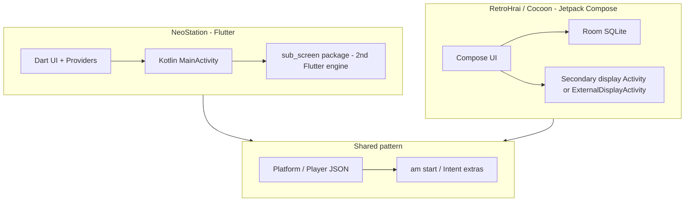

# Overview — Wajiha and the study corpus

## Product intent

Wajiha aims to be the **primary Android shell** on retro handhelds:

- **Home launcher** (`MAIN` + `HOME` intent filters)
- **Game library** browser with metadata scraping and favorites
- **Emulator orchestration** — launch external APK emulators / RetroArch via intents
- **System control** — brightness, apps drawer, optional widgets
- **Dual-display UX** for devices like **AYN Thor** (main game UI on top screen, controls / now-playing / app dock on bottom)
- **Single-display mode** — same codebase, secondary features hidden or inlined

## Current Wajiha codebase state

The repo is a **fresh KMP template**:

- `composeApp/` — shared Compose UI (`App.kt` is placeholder)
- `androidApp/` — standard Android host (`MainActivity.kt`)
- No launcher manifest, no ROM DB, no dual-display code yet

All substantial reference logic lives under `Study/`.

## Why these four references?

| App | Why it matters |
|-----|----------------|
| **NeoStation** | Only **full open-source** stack: Flutter UI + documented architecture + production-grade Android launcher/dual-screen/emulator launch code |
| **Daijishō** | **De facto standard** for platform/player JSON; huge community platform packs; conceptual model (platform → player → ROM paths) |
| **RetroHrai** | Modern **native Compose** launcher with explicit **dual-screen** (`SecondaryDisplayActivity`, `SECONDARY_HOME`) and Daijishō-compatible assets baked in |
| **Cocoon** | Beta **Compose + Room** shell with **widget grid**, Discord/RA, **ExternalDisplayActivity** |
| **iiSU** | **Thor-oriented** Compose HOME: **SECONDARY_HOME**, display blackout on launch, keep-alive restore, XMB browser, RomM, 173-console JSON |

## Architectural families

## AYN Thor implications

AYN Thor-class devices typically expose:

- **Two physical displays** with distinct `displayId`s
- A **built-in gamepad** mapped to Android key events
- Users expect **bottom screen** for touch/dock and **top** for content (mirroring DS / 3DS / Flip handhelds)

Implementation options seen in references:

1. **Second Activity on secondary display** with `SECONDARY_HOME` (RetroHrai)
2. **Presentation + second Flutter engine** (NeoStation via `MultiDisplayFlutterActivity`)
3. **Dedicated ExternalDisplayActivity** (Cocoon)
4. **SecondaryHomeActivity + DualDisplayPresentation + keep-alive** (iiSU)

Wajiha should pick one primary model; NeoStation, RetroHrai, and **iiSU** are the strongest blueprints for AYN Thor.

## Next implementation phases (suggested)

1. Android manifest: landscape, HOME launcher, gamepad, storage permissions
2. Platform/player JSON loader (Daijishō-compatible schema)
3. Room or SQLDelight game library + ROM scan
4. `EmulatorLauncher`-style intent builder in `androidMain`
5. Dual-display abstraction with single-display fallback
6. Gamepad navigation layer (see NeoStation `GamepadNavigationManager`)

See [01-comparison-matrix.md](./01-comparison-matrix.md) for per-app feature mapping.
