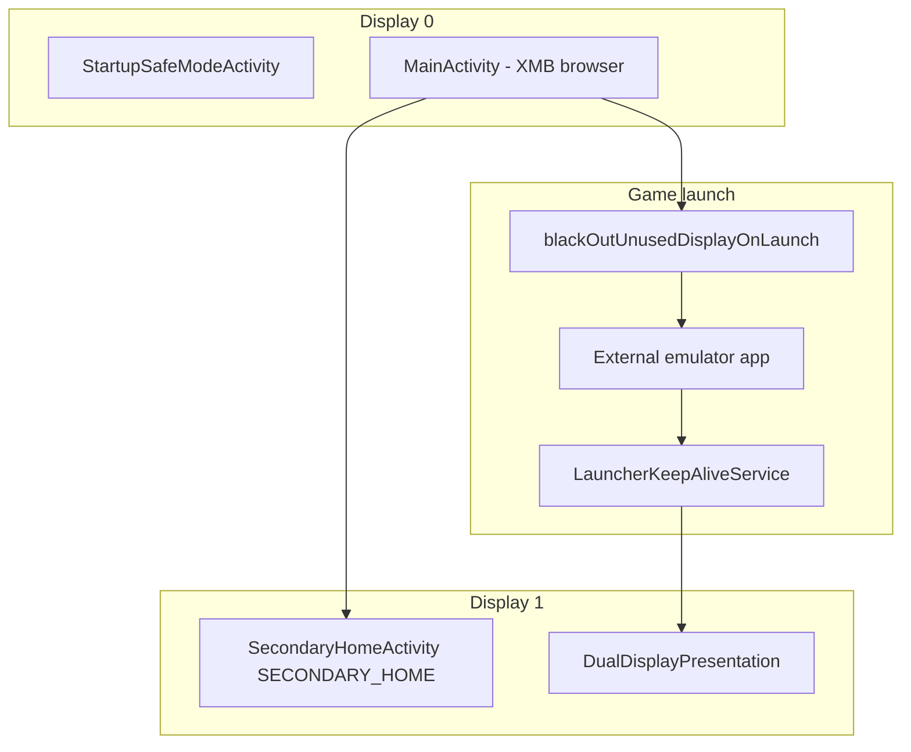

# iiSU APK analysis

**File:** `Study/iiSU-Alpha-0.0.7.3.apk` (~121 MB)  
**Extracted:** `Study/_extracted/iisu/`  
**Package:** `com.iisulauncher`  
**Manifest version:** `0.1.6.1` (versionCode 9) — filename says *Alpha 0.0.7.3*; treat manifest as ground truth.  
**SDK:** min **30** (Android 11+), target 34, compile 36  
**Stack (inferred):** Kotlin, Jetpack Compose, Hilt, Room (playtime), WorkManager, Discord Social SDK, `rcheevos_jni`

## Role in ecosystem

**iiSU** is a polished **native Compose HOME launcher** aimed at dual-screen handhelds. It is one of the **strongest Thor-relevant references** alongside NeoStation and RetroHrai:

- Explicit **dual-display state machine** (`DualDisplayStateMachine`, `DualDisplayPresentation`)
- **`SECONDARY_HOME`** activity
- **`blackOutUnusedDisplayOnLaunch`** — power/UX optimization when only one screen is needed during play
- **XMB-inspired** console/app browser (not grid-only)
- **Custom emulator JSON** (not Daijishō `amStartArguments`; closer to structured commands with `%ROM%` / `%PACKAGE%` placeholders)
- **RomM**, **ScreenScraper**, **SteamGridDB** integrations
- **Discord** rich presence + friends panel (like Cocoon)

## Manifest highlights

### Launcher entry (unusual)

| Activity | Role |
|----------|------|
| `StartupSafeModeActivity` | **Exported HOME + LAUNCHER** entry — safe-mode / recovery path before normal shell |
| `MainActivity` | Main shell UI; deep links `iisu://nightly-auth`, `iisu://google-calendar-auth` |
| `SecondaryHomeActivity` | **`SECONDARY_HOME`** — bottom / external display |
| `RootlessExternalBackstopActivity` | Task affinity `com.iisulauncher.rootless_backstop` — fallback when launching on external display without root |

### Services

| Service | Role |
|---------|------|
| `LauncherKeepAliveService` | Foreground `specialUse` — *"Keeps iiSU dual-display restore state alive while an externally launched app is active"* |
| `RetroHashService` | Background RetroAchievements hash registration (`RetroHashWorker`) |
| `SystemNotificationListenerService` | Media / system notifications for now-playing UI |
| `com.discord.socialsdk.ForegroundService` | Discord SDK |

### Permissions (notable)

- `MANAGE_EXTERNAL_STORAGE` — broad ROM access
- `READ_CALENDAR` + Google Calendar OAuth deep link
- `FOREGROUND_SERVICE_SPECIAL_USE` — keep-alive for dual-display restore
- `RECORD_AUDIO`, Discord-related foreground service types
- `RECEIVE_BOOT_COMPLETED`
- No `QUERY_ALL_PACKAGES` in manifest snippet — uses `<queries>` LAUNCHER intent only

## Native libraries

| Library | Role |
|---------|------|
| `librcheevos_jni.so` | RetroAchievements hashing |
| `libdiscord_partner_sdk.so`, `libdiscord_jni.so` | Discord Social SDK |
| Media3 shader assets in `assets/shaders/` | GPU thumbnail/video effects |

## Package structure (DEX)

```
com.iisulauncher/
├── LairLauncherApplication
├── launcher/
│   ├── StartupSafeModeActivity      # HOME entry
│   ├── MainActivity
│   ├── SecondaryHomeActivity
│   ├── RootlessExternalBackstopActivity
│   ├── dualdisplay/
│   │   ├── DualDisplayManager
│   │   ├── DualDisplayStateMachine
│   │   ├── DualDisplayPresentation
│   │   └── LauncherKeepAliveService
│   ├── playtime/                    # Room playtime DB
│   └── ui/
│       ├── home/                    # XMB browser, widgets, dialogs
│       └── renderer/                # BrowserEngine, grid layout
├── roms/RomItem
├── apps/InstalledApp
├── scrapers/                        # ScreenScraper match UI
├── steamgriddb/
├── retroachievements/
├── discord/DiscordManager
└── settings/                        # Theme, widgets, dual-display prefs
```

## Dual-display architecture (Thor-relevant)



Key behaviors (from dex strings):

| Feature | Description |
|---------|-------------|
| `DualDisplayStateMachine` | Central coordinator for connected displays |
| `DualDisplayPresentation` | Overlay / presentation layer on secondary |
| `disableHeroesOnSecondaryDisplay` | User pref to simplify secondary visuals |
| `setBlackOutUnusedDisplayOnLaunch` | Turn off unused panel when game runs on one display |
| `SECONDARY_HOME_ENSURE` | Intent extra to force secondary activity presence |
| `LauncherKeepAliveService` | Survives while external app foreground; restores iiSU on exit |
| Onboarding assets | `enableDS-*` / `disableDS-*` — dual-screen setup walkthrough |

**Comparison:** Same family as RetroHrai (`SecondaryDisplayActivity` + `SECONDARY_HOME`) but iiSU adds **keep-alive service**, **display blackout on launch**, and **safe-mode HOME entry**.

## Emulator configuration (iiSU-native JSON)

**Not** Daijishō `amStartArguments`. Bundled configs:

| Asset | Purpose |
|-------|---------|
| `assets/emuladores_default.json` | **173 consoles** — full launch definitions |
| `assets/iiSu/emuladores_default.jsonc` | Commented template / editable copy |
| `assets/supported_emulators_default.json` | Emulator name → package list registry |
| `assets/default_emulator_options.json` | Per-console default emulator + `routeType` + `launchPreference` |

### Console entry shape

```json
{
  "shortName": "3do",
  "longName": "3DO Interactive Multiplayer",
  "retroAchievementsId": "43",
  "romExtensions": [".iso", ".cue", ".chd", ".zip"],
  "emulators": [
    {
      "id": "retroarch",
      "name": "RetroArch",
      "routeType": "path",
      "packages": ["com.retroarch", "com.retroarch.aarch64", "com.retroarch.ra32"],
      "commands": [
        {
          "description": "Opera core",
          "command": "%PACKAGE%/com.retroarch.browser.retroactivity.RetroActivityFuture -e CONFIGFILE ... -e LIBRETRO opera_libretro_android.so -e ROM %ROM% --activity-clear-top"
        }
      ]
    }
  ]
}
```

### Placeholders

| Token | Meaning |
|-------|---------|
| `%ROM%` | Path or URI per `routeType` |
| `%ROM_PATH%` | Filesystem path |
| `%ROM_URI%` | SAF content URI |
| `%PACKAGE%` | Expanded across `packages[]` for RetroArch variants |

`routeType`: `"path"` vs `"uri"` — same conceptual split as NeoStation `neostation-realpath` vs `neostation-localuri`.

`importSupportedEmulatorsJson(Uri)` — user can import updated emulator database.

## Other bundled assets

| Asset | Size / notes |
|-------|----------------|
| `iiSU_StarterPack.zip` | ~35 MB — starter platforms/media pack |
| `home_theme.ogg`, UI `.wav` files | Shell sound design |
| `onboarding.mp3` + PNG flows | First-run including dual-screen choice |
| `psvita_title_ids.json` | Vita title ID lookup |
| `iiSu/xmb-controller.png` | XMB chrome |

## Integrations

| Integration | Evidence |
|-------------|----------|
| **RomM** | `downloadRommRom`, `RommSyncProgress`, SAF folder access, weak hash checks |
| **ScreenScraper** | `api2/jeuRecherche.php`, scraper match selection UI |
| **SteamGridDB** | Home icon batch apply, API preferences URL |
| **RetroAchievements** | `RetroHashService`, `rcheevos_jni`, hash cache clear |
| **Discord** | Friends panel, presence, native bridge, OAuth activity |
| **Google Calendar** | `iisu://google-calendar-auth` |

## Room database (playtime only in dex)

| Table | Purpose |
|-------|---------|
| `playtime_entries` | Aggregated play time per title |
| `playtime_sessions` | Individual sessions |
| `active_playtime_sessions` | In-flight session tracking |
| `recent_playtime_entries` | Recents ordering |
| `playtime_metadata` | Key-value metadata |

ROM/library state likely uses DataStore / files / RomM — not exposed as simple Room `CREATE TABLE` in dex sample.

## UI paradigms

- **XMB browser** — `BrowserEngine`, horizontal categories, `romBrowserXmbSettledPrefetch`
- **Home widgets** — image, web, clock-style `HomeIisuWidgetKind`, Android AppWidget picker
- **Global search** — `GlobalSearchResult`
- **Context menus** — rich ROM/app media management (SteamGridDB icons per game)
- **Friends panel** — Discord overlay dialog

## Home styles (onboarding)

Onboarding PNGs reference multiple shell modes:

- `standard`, `xmb`, `wiisu`, `enableDS` / `disableDS` (dual-screen on/off)

## Wajiha takeaways

1. **Best dual-display power UX reference:** `blackOutUnusedDisplayOnLaunch` + `LauncherKeepAliveService` — study for AYN Thor battery behavior.
2. **Safe-mode HOME entry** — consider crash-loop protection for a device shell.
3. **Emulator config:** iiSU JSON is a **third format** alongside Daijishō and NeoStation; Wajiha importer may need multiple backends.
4. **Use bundled `emuladores_default.json`** (173 consoles) as test fixtures in `Study/_extracted/iisu/assets/`.
5. **minSdk 30** — iiSU targets modern Android only; Wajiha can match for Thor-focused builds.

## Limitations

- Closed source; alpha-quality versioning mismatch in filename vs manifest
- Large Discord dependency footprint
- No public source for `DualDisplayStateMachine` implementation details beyond dex strings

## Extract commands

```bash
unzip -qo Study/iiSU-Alpha-0.0.7.3.apk -d Study/_extracted/iisu
apkanalyzer manifest print Study/iiSU-Alpha-0.0.7.3.apk
strings Study/_extracted/iisu/classes*.dex | rg 'com/iisulauncher'
```
