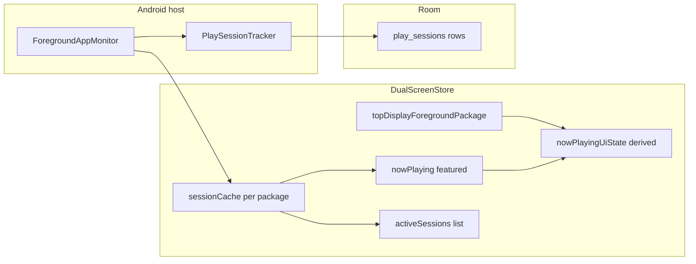

# Active game sessions

Wajiha tracks multiple concurrent emulator sessions on Thor (launch game A, then B without closing A).

## State layers

| Concept | Field | Meaning |
|---------|-------|---------|
| All live sessions | `sessionCache` | Map package → `NowPlayingState`; survives task switches |
| Featured | `nowPlaying` | Grid highlight, Now Running panel, RA follow |
| On display 0 | `topDisplayForegroundPackage` | Which game is on Thor top screen |
| Chip visibility | `nowPlayingUiState` | Floating chip / dim overlay — non-null only when featured session is visible |
| Session grid | `activeSessions` | Sorted list for grid tiles in `BottomScreen` |

## Lifecycle

**Start**

- Wajiha launch: `GameLauncher` → `DualScreenStore.beginGameSession` → `PlaySessionTracker.onGameLaunched`
- External: `ForegroundAppMonitor` detects foreground package → `beginOrUpdateExternalSession`

**During**

- Poll interval: **2 s** idle, **750 ms** when sessions active
- Per-package end detection via `GameSessionController` (dead streaks + usage events)
- Task switch: `AndroidAppActions.focusApp` → `SessionTaskRegistry.moveToFront`

**End**

- Y-close on session grid tile → `killApp` → `endGameSession`
- Confirmed process exit → `PlaySessionTracker.onGameEnded(package)`
- Return to launcher with no sessions → `PlaySessionTracker.onLauncherResumed(false)` closes all DB rows

## UI

- **Session grid** — tiles in `BottomScreen` via `SessionGridTile` (same 3:4 aspect as game tiles)
- **Floating chip** — `NowPlayingOverlay` when `nowPlayingDisplay` includes chip mode
- **Now Running** — full panel (`NowPlayingPanel`) on single-display or via navigation request

Settings → Screens controls chip vs grid vs both (`NowPlayingDisplayMode`).

## Playtime persistence

`PlaySessionTracker` maintains a `Map<String, ActiveLaunch>` aligned with `sessionCache`. Each package gets its own open `play_sessions` row; closing one does not affect others.
